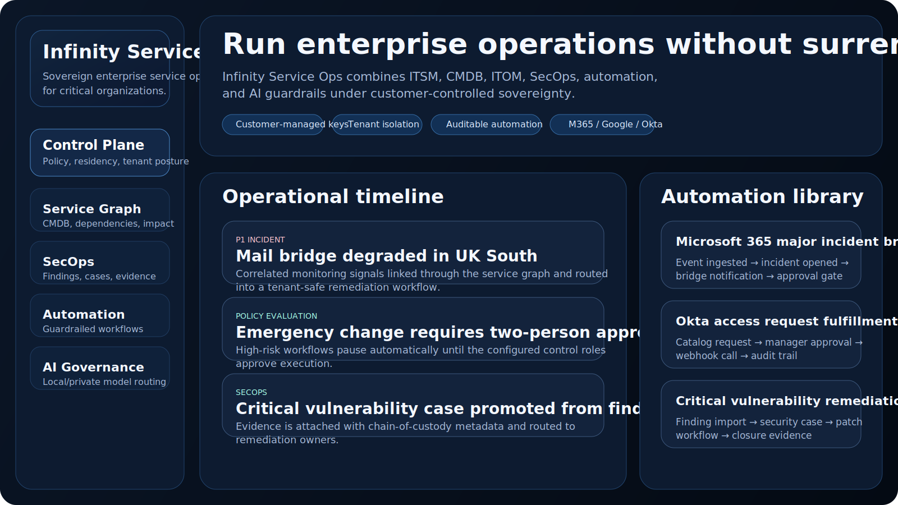
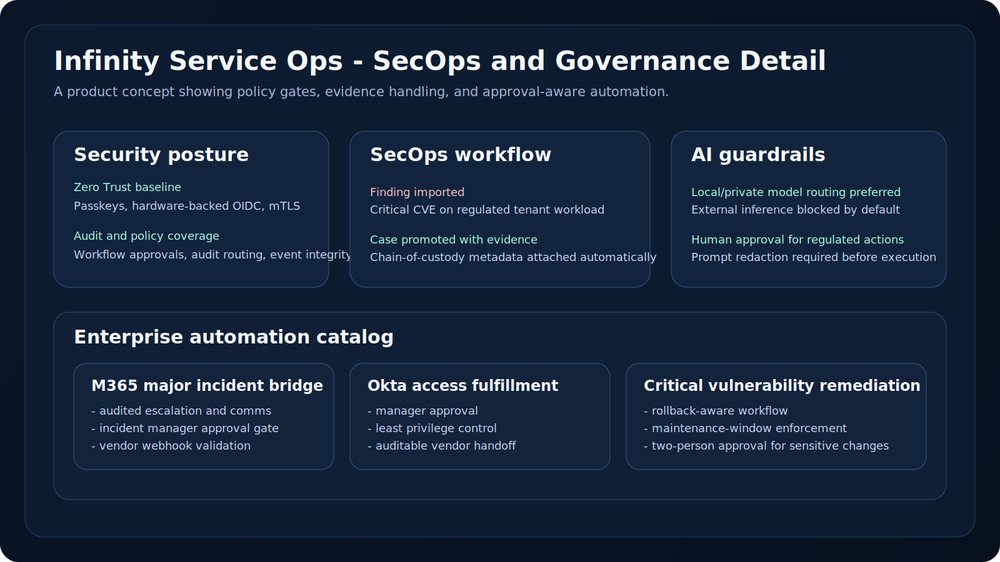

# Infinity Service Ops

Infinity Service Ops is an open source, security-first service operations platform for organizations that cannot afford to give away control of critical systems data.

> You do not own your data if your critical systems data resides in someone else's cloud.

This project is designed as a sovereign alternative to large proprietary service-management platforms. It is focused on:

- ITSM
- CMDB and service graph
- ITOM event ingestion
- SecOps workflows
- guardrailed automation
- auditable AI
- native enterprise integrations

## Why this exists

Most large enterprise workflow platforms offer convenience, but they also create lock-in:

- vendor-controlled hosting
- opaque data movement
- premium integration gates
- AI features that can blur data boundaries
- limited true sovereignty even when data residency is offered

Infinity Service Ops is built to prioritize:

- self-hosting
- air-gap readiness
- customer-managed keys
- tenant isolation
- auditable automation
- explicit AI egress controls
- open architecture in Rust

## Current project status

This repository is currently a **high-quality architecture and domain scaffold** rather than a finished product.

What is already implemented:

- multi-crate Rust workspace
- foundational runtime apps
- shared platform primitives
- tenancy / RBAC / audit modeling
- ITSM aggregate behaviors
- CMDB graph modeling
- ITOM event normalization
- SecOps case and remediation primitives
- workflow engine primitives
- AI execution guardrails
- knowledge search with citations
- automation template library

## Showcase

### Infinity Service Ops control plane concept



### Infinity Service Ops dashboard detail



## Architecture

### Runtime apps

- `apps/control-plane`  
  Administrative and policy-oriented entry point for tenant, posture, and platform governance.

- `apps/api-gateway`  
  API boundary and request-side security posture stub.

- `apps/worker`  
  Async execution foundation for jobs, workflow steps, and projections.

- `apps/connector-host`  
  Vendor connector execution boundary.

- `apps/event-relay`  
  Event/outbox/inbox transport boundary.

- `apps/migrator`  
  Logical schema and migration bootstrap surface.

### Shared crates

- `crates/platform-core`  
  Shared IDs, timestamps, actor models, security context, paging, and record primitives.

- `crates/event-core`  
  Event metadata and envelopes.

- `crates/persistence-core`  
  Outbox/inbox abstractions, repository traits, and audit store hooks.

- `crates/audit-core`  
  Audit records and stream routing.

### Domain crates

- `crates/platform-domain`  
  Tenancy, RBAC, policy hooks, audit events, incidents, requests, changes, problems, catalog, and knowledge models.

- `crates/cmdb-domain`  
  Configuration items, relationship graph, impact traversal.

- `crates/itom-domain`  
  Normalized operational events, deduplication keys, maintenance-window suppression.

- `crates/secops-domain`  
  Findings, security cases, evidence, remediation tasks.

- `crates/workflow-engine`  
  Workflow triggers, actions, approvals, retries, execution history.

- `crates/search-knowledge`  
  Citation-based retrieval primitives for AI-safe knowledge lookup.

- `crates/automation-library`  
  Enterprise automation templates, vendor integration profiles, and production guardrails.

- `crates/ai-orchestrator`  
  AI execution planning and provider guardrails with redaction and approval-aware behavior.

## Security model

Infinity Service Ops is being designed with **security-by-default** assumptions:

- zero-trust identity model
- tenant isolation as a first-class concern
- customer-managed encryption posture
- passkeys and hardware-backed OIDC in the baseline
- audit surfaces across lifecycle transitions
- policy evaluation hooks for sensitive actions
- local/private AI preference
- external AI blocked unless explicitly allowed
- automation with approval gates for sensitive operations
- connector isolation as a separate runtime concern

### Important security note

This scaffold is not "impenetrable" today, and no honest platform can guarantee that. What it does provide is:

- secure defaults in the architecture
- explicit modeling of trust boundaries
- policy hooks where enforcement belongs
- a structure ready for deeper hardening

Further production hardening still required:

- real authn/authz enforcement middleware
- signed connector manifests
- request signing and replay protection
- tamper-evident audit chain persistence
- secret broker / KMS integration
- row-level security and per-tenant persistence isolation
- network egress policy enforcement
- backup / restore / key rotation procedures
- full threat modeling and penetration testing

## Automation library

Infinity Service Ops now ships with an initial automation library intended to be more enterprise-oriented and guardrailed than simplistic “if this then that” workflow packs.

### Included templates

1. **Microsoft 365 major incident bridge**
   - opens incidents from major operational signals
   - sends notifications
   - creates follow-up tasks
   - enforces approval gates

2. **Okta access request fulfillment**
   - processes access requests
   - routes approval
   - supports external fulfillment hooks
   - keeps audit coverage

3. **Critical vulnerability remediation**
   - promotes findings into cases
   - orchestrates remediation tasks
   - requires approval
   - expects rollback-aware production controls

### Why this matters

A lot of paid platforms sell workflow flexibility, but in practice enterprise teams need:

- reusable automations
- safe defaults
- approval-aware workflows
- vendor compatibility
- deployment guardrails

The automation library is structured around those principles.

## Integration strategy

First-class integration direction includes:

- Microsoft 365
- Entra ID
- Intune
- Defender
- Google Workspace
- Cloud Identity
- Okta
- Slack
- Teams
- GitHub
- GitLab
- Jira
- Kubernetes
- Terraform
- Vault
- Prometheus / Grafana / OpenTelemetry

### Integration principles

- no silent data egress
- connector capabilities declared explicitly
- vendor interactions mediated through isolated runtime boundaries
- automation templates must declare required connector capabilities
- production workflows must expose approval and audit guardrails

## Competitor comparison

### ServiceNow

**Strengths**
- unmatched breadth
- deep enterprise process coverage
- mature ITSM / ITOM / CMDB / SecOps ecosystem
- strong partner network

**Weaknesses**
- expensive
- proprietary
- customer data/control trade-offs
- can become heavily locked into platform-specific patterns

### Microsoft ecosystem

**Strengths**
- strong native fit for Microsoft-heavy enterprises
- deep integration across Entra, Intune, Defender, Azure, Power Platform, and M365

**Weaknesses**
- fragmented product surface
- licensing complexity
- strong ecosystem lock-in

### Atlassian

**Strengths**
- strong for engineering and DevOps organizations
- great fit where Jira is already central

**Weaknesses**
- less broad as a sovereign enterprise operations control plane
- marketplace dependence can complicate governance

### Salesforce

**Strengths**
- excellent for customer-service-centric organizations
- strong workflow and CRM integration story

**Weaknesses**
- not naturally centered on sovereign IT/operations control
- heavy ecosystem dependence

### Ivanti / BMC / ManageEngine / Freshworks

**Strengths**
- practical ITSM/ITAM alternatives
- faster adoption in some segments
- some strong endpoint/security ties

**Weaknesses**
- usually less open
- varying depth across sovereignty, auditability, and extensibility

### Infinity Service Ops position

Infinity Service Ops is trying to win on:

- sovereignty
- openness
- security-by-design
- transparent automation
- auditable AI
- neutral cross-vendor orchestration

## Getting started

### Requirements

- Rust toolchain

### Verify the workspace

```powershell
cargo test --workspace
```

### Run representative binaries

```powershell
cargo run -p control-plane
cargo run -p api-gateway
cargo run -p worker
cargo run -p connector-host
cargo run -p event-relay
cargo run -p migrator
```

## CI

Basic CI has been added at:

- `.github/workflows/ci.yml`

It currently runs:

- `cargo fmt --all --check`
- `cargo test --workspace`

## Roadmap

### Near-term

- persist the current domain models in PostgreSQL
- add real Axum APIs
- add tenant-safe storage boundaries
- enforce workflow guardrails at runtime
- build a real web UI over the current architecture

### Later

- signed connector packages
- richer workflow packs
- deeper Microsoft / Google / Okta integration
- policy-as-code engine integration
- production-grade deployment references
- private model routing and secure AI evaluation harnesses

## License

Intended license: Apache-2.0
